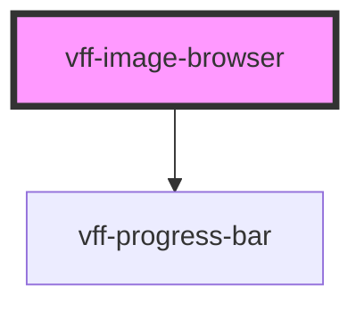

# vff-image-browser

<!-- Auto Generated Below -->

## Properties

| Property         | Attribute         | Description | Type      | Default |
| ---------------- | ----------------- | ----------- | --------- | ------- |
| `error`          | `error`           |             | `string`  | `''`    |
| `progress`       | `progress`        |             | `boolean` | `false` |
| `progressStatus` | `progress-status` |             | `number`  | `0`     |
| `selectedFiles`  | --                |             | `File[]`  | `[]`    |

## Events

| Event        | Description | Type               |
| ------------ | ----------- | ------------------ |
| `vff:change` |             | `CustomEvent<any>` |

## Methods

### `addFiles(files: any) => Promise<void>`

#### Returns

Type: `Promise<void>`

## Dependencies

### Depends on

- [vff-progress-bar](../progress-bar)

### Graph

----------------------------------------------

*Built with [StencilJS](https://stenciljs.com/)*
