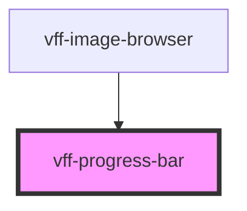

# vff-progress-bar

<!-- Auto Generated Below -->

## Properties

| Property | Attribute | Description | Type     | Default |
| -------- | --------- | ----------- | -------- | ------- |
| `status` | `status`  |             | `number` | `0`     |

## Dependencies

### Used by

 - [vff-image-browser](../image-browser)

### Graph

----------------------------------------------

*Built with [StencilJS](https://stenciljs.com/)*
